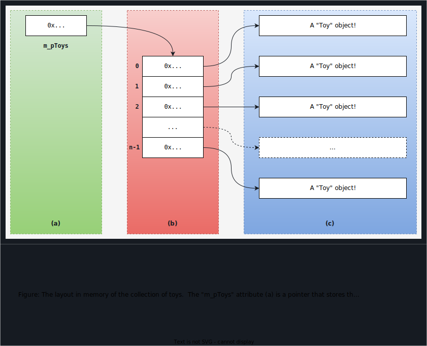

# Type Relations: A Shopping Cart for Toys

> [!NOTE]
> This is not a marked exercise and is not required to be submitted for credit. The purpose of the exercise is to practice concepts from the course material.
>
> At the end of the exercise, you are instructed to write a reflection: this will help you put into words what you have learned and make you think at the new concepts and explain them.  Explaining something to another person is one of the best ways to reveal concepts that are not clear to you and require further investigation.

In this exercise, you will design and code an application that will allow small children to order toys from an online store. Before the order is placed for payment and delivery, the parents must approve the purchase; a confirmation order system must also be implemented to ensure that the parents agree with the purchase.


## Learning Outcomes

Upon successful completion of this workshop, you will have demonstrated the abilities to:

- design and code composition and aggregation class relationships
- use member functions of the string class to parse a string into tokens based on simple rules
- design and code a class that manages a dynamically allocated array of pointers to objects (double pointers)


## Compiling and Testing Your Program

All your code should be compiled using this command on `matrix`:

```bash
/usr/local/gcc/10.2.0/bin/g++ -Wall -std=c++17 -g -o ws file1.cpp file2.cpp ...
```

- `-Wall`: compiler will report all warnings
- `-std=c++17`: the code will be compiled using the C++17 standard
- `-g`: the executable file will contain debugging symbols, allowing *valgrind* to create better reports
- `-o ws`: the compiled application will be named `ws`

After compiling and testing your code, run your program as following to check for possible memory leaks (assuming your executable name is `ws`):

```bash
valgrind --show-error-list=yes --leak-check=full --show-leak-kinds=all --track-origins=yes ws
```

- `--show-error-list=yes`: show the list of detected errors
- `--leak-check=full`: check for all types of memory problems
- `--show-leak-kinds=all`: show all types of memory leaks identified (enabled by the previous flag)
- `--track-origins=yes`: tracks the origin of uninitialized values (`g++` must use `-g` flag for compilation, so the information displayed here is meaningful).
x
To check the output, use a program that can compare text files.  Search online for such a program for your platform, or use *diff* available on `matrix`.


## A Shopping Cart for Toys

In this application you create a shopping cart for an online toy store. Children who use the application will add some toys to the shopping cart. Before an order is placed, it must be approved by the parents of the child; you will design confirmation order module that is responsible to inform the parents about the child order and retrieve their approval before proceeding to the checkout. For simplicity, only some functionality will be implemented as part of this exercise.

In all classes that you create, you are allowed to add any **private** members that your design requires (without changing the specs)!  You can also add any **special** public members that are necessary for your design.

Enclose all your source code within the `seneca` namespace and include the necessary guards in each header file.


### `tester_1` Module (supplied)


**Do not modify this module!**  Look at the code and make sure you understand it.


### `toy` Module

This module includes the definition of a class that manages information about a single toy.

Design and code a class named `Toy` that can store the following information (for each attribute, choose any type that you think is appropriate--you must be able to justify the decisions you make):

- **id**: the id of the toy (a positive number).
- **name**: the name of the toy.
- **number of items**: the number of toys of this type to be ordered.
- **price**: the price of this toy (without tax).
- **harmonized sales tax**: assume the HST is equal to 13%.


#### Public Members

- a default constructor
- `void update(int numItems)`: a modifier that receives as a parameter the number of toys of this type to be ordered and updates the number of items attribute with the received value. Assume the parameter is correct and doesn't require validation.
- `Toy(const std::string& toy)`: A constructor that receives the toy attributes as a string; this constructor is responsible for extracting information about the toy from the string and storing the tokens in the instance's attributes. The string will always have the following format:

  ```txt
  ID:NAME:NUM:PRICE
  ```

  This constructor should remove all leading and trailing spaces from the **beginning and end** of any token extracted from the string.

  When implementing the constructor, consider these following functions:
  - [std::string::substr()](https://en.cppreference.com/w/cpp/string/basic_string/substr)
  - [std::string::find()](https://en.cppreference.com/w/cpp/string/basic_string/find)
  - [std::string::erase()](https://en.cppreference.com/w/cpp/string/basic_string/erase)
  - [std::stoi()](https://en.cppreference.com/w/cpp/string/basic_string/stol)


#### Friend Helpers

- overload the insertion operator to insert the contents of a toy object into an `ostream` object:

  ```txt
  Toy ID: NAME QTY items @ PRICE/item  subtotal: SUBTOTAL  tax: TAX  total: TOTAL_PRICE<endl>
  ```

  where

  - `ID` is a *right aligned* field of size 8 using `0` as a padding character (the toy identifier)
  - `NAME` is a *right aligned* field of size 24 using `.` as a padding character (the name of the toy)
  - `QTY` is a *right aligned* field of size 2 using space as a padding character (the number of items in the order)
  - `PRICE` is a *right aligned* field of size 6 using space as a padding character, with exactly 2 digits after the period (the price of a single item)
  - `SUBTOTAL` is a *right aligned* field of size 7 using space as a padding character, with exactly 2 digits after the period (the price of all items)
  - `TAX` is a *right aligned* field of size 6 using space as a padding character, with exactly 2 digits after the period (the amount of tax for the subtotal)
  - `TOTAL_PRICE` is a *right aligned* field of size 7 using space as a padding character, with exactly 2 digits after the period (the subtotal plus tax)

  After finishing printing, make sure that the function doesn't have side effects.

  Look in the sample output file for hints about formatting


### `shoppingCart` Module

Design and code a class named `ShoppingCart` that manages a collection of toys that a child wants to buy.  This class should have attributes to store the name and age of the child, and manage a dynamically allocated array of pointers of type `Toy`: `const seneca::Toy**` (each element of the array points to an object of type `Toy`).

*🗎 Explain in the reflection what is the relationship between `ShoppingCart` and `Toy`, and what is the relationship between `ShoppingCart` and the **array** of pointers.*


#### Public Members

- `ShoppingCart(const std::string& name, int age, const Toy* toys[], size_t count)`: a constructor that receives as a parameter a name and age of a child, and an array of pointers to objects of type `Toy` (i.e., each element of the array is a pointer). If you need a refresh on arrays of pointers, re-read the material from the last term (chapter **Abstract Base Classes**, section **Array of Pointers**).
  - this constructor should store **copies** of all the toys

- add any other special members that are necessary to manage the toys stored

#### Friend Helpers

- overload the insertion operator to insert the content of a `ShoppingCart` object into an `ostream` object. This operator should use a local to function variable to count how many times this operator has been called (`CALL_CNT` below). It should also insert the child's name (`NAME` below) and the child's age (`AGE` below):

  - if the shopping cart contains no data:

  ```txt
  --------------------------
  Order CALL_CNT: This shopping cart is invalid.
  --------------------------
  ```

  - if there are no toys:

  ```txt
  --------------------------
  Order CALL_CNT: Shopping for NAME AGE years old (0 toys)
  --------------------------
  Empty shopping cart!
  --------------------------
  ```

  - if there are toys:

  ```txt
  --------------------------
  Order CALL_CNT: Shopping for NAME AGE years old (NUMBER_OF_TOYS toys)
  --------------------------
  TOY
  TOY
  ...
  --------------------------
  ```


### `confirmationOrder` Module

Design and code a class named `ConfirmationOrder` to your project. The purpose of this class is to contact the parents of the children who want to shop and retrieve approval before placing an order.

This module should maintain a dynamically allocated array of **pointers** to objects of type `Toy`: `const seneca::Toy**` (each element of the array is a pointer to an object of type `Toy`).

This class should have attributes to store and manage a **dynamically-allocated array of pointers** to objects of type `Toy`: `const sdds::Toy**` (each element of the array points to an object of type `Toy`). ***Very Important***: This class is responsible for managing the array of pointers but is not managing the life of `Toy` objects.



*🗎 Explain in the reflection what is the relationship between `ConfirmationOrder` and `Toy`, and what is the relationship between `ConfirmationOrder` and the **array** of pointers.*

#### Public Members

- add any special members that are necessary to manage the resource (the resource is an **array of pointers**; your class must manage this array, but the objects at the addresses stored in the array are managed outside this class)

- `ConfirmationOrder& operator+=(const Toy& toy)`: adds the toy `toy` to the array by adding its address.
  - if the address of `toy` is already in the array, this operator does nothing
  - resizes the array to make room for `toy` if necessary
  - stores the **address** of `toy` in the array (your function should not make copies of the toy itself)

- `ConfirmationOrder& operator-=(const Toy& toy)`: removes the toy `toy` from the array by removing its address
  - if the address of `toy` is not in the array, this operator does nothing
  - searches the array for the address of `toy`; if found at index `idx`, shifts all the elements of the array that appear after `idx` to the previous index.
  
  **To challenge yourself, try to actually resize the array.**


***Friend Helpers***

- overload the insertion operator to insert the content of a `ConfirmationOrder` object into an **ostream** object:
  - if there are no toys to confirm:

  ```txt
  --------------------------
  Confirmations to Send
  --------------------------
  There are no confirmations to send!
  --------------------------
  ```

  - if there are toys to confirm

  ```txt
  --------------------------
  Confirmations to Send
  --------------------------
  TOY
  TOY
  ...
  --------------------------
  ```


### Sample Output

The input file `data.txt` is provided.

When the program is started with the command:

```bash
ws data.txt
```

the output should look like the one from the `sample_output.txt` file.

> [!CAUTION]
> Please note that a matching output is not a guarantee that the program is bug-free; it only means that in the specific tests this tester performed, no bugs/issues were identified. It is possible to write a tester that looks at other aspects of your code that will reveal bugs.


### Reflection

Study your final solution, reread the related parts of the course notes, and make sure that you have understood the concepts covered by this workshop. **This should take no less than 30 minutes of your time and the result is suggested to be at least 150 words in length.**

Create a **text** file named `reflect.txt` that contains your detailed description of the topics that you have learned in completing this particular workshop and mention any issues that caused you difficulty and how you solved them. Include in your explanation—**but do not limit it to**—the following points:

- the difference between the implementations of a composition and an aggregation. Note that both classes `ShoppingCart` and `ConfirmationOrder` have an attribute of type `const Toy**` and yet they are in different relationships with class `Toy`.  *Discuss!*
- the difference between the implementations of move and copy functions in a composition and an aggregation.
- discus what changes would be necessary in this program to be able to add and remove toys from the `ShoppingCart` in the same manner as it happens for `ConfirmationOrder`.

Identify places in your code where you have used **association**, **aggregation** and **composition** relations.
