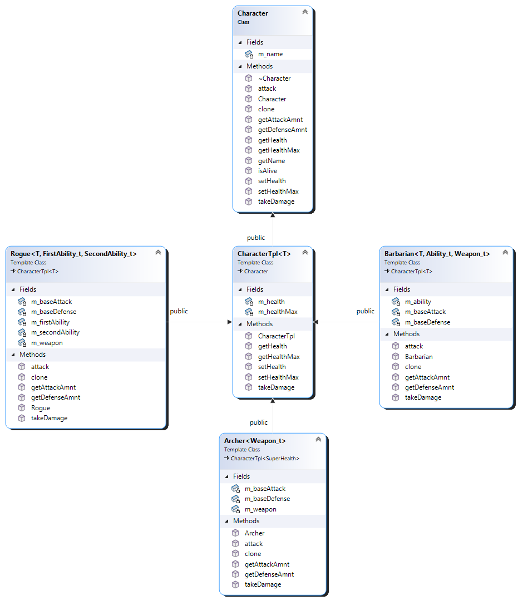

# Workshop #2: RPG Game

In this workshop, you will create an application that implements a rudimentary structure of an RPG game. The game will feature multiple classes of characters, each one capable of using weapons and special abilities in their quest to defeat their enemies. Each player will be part of a team and can join a guild for extra bonuses.


## Compiling and Testing Your Program

All your code should be compiled using this command on `matrix`:

```bash
/usr/local/gcc/10.2.0/bin/g++ -Wall -std=c++17 -g -o ws file1.cpp file2.cpp ...
```

- `-Wall`: compiler will report all warnings
- `-std=c++17`: the code will be compiled using the C++17 standard
- `-g`: the executable file will contain debugging symbols, allowing *valgrind* to create better reports
- `-o ws`: the compiled application will be named `ws`

After compiling and testing your code, run your program as following to check for possible memory leaks (assuming your executable name is `ws`):

```bash
valgrind --show-error-list=yes --leak-check=full --show-leak-kinds=all --track-origins=yes ws
```

- `--show-error-list=yes`: show the list of detected errors
- `--leak-check=full`: check for all types of memory problems
- `--show-leak-kinds=all`: show all types of memory leaks identified (enabled by the previous flag)
- `--track-origins=yes`: tracks the origin of uninitialized values (`g++` must use `-g` flag for compilation, so the information displayed here is meaningful).

To check the output, use a program that can compare text files.  Search online for such a program for your platform, or use `diff` available on `matrix`.


## Dictionary

This application will implement three different classes of characters that the player can choose at the begining of the game and will simulate the fight between two players.

Put all the global variables, global functions/operator overloads, and types inside the `seneca` namespace.


### `tester_1` Module (supplied)


**Do not modify this module!**  Study the code supplied and make sure you understand it.


### `abilities` Module (supplied)


This module contains the logic of some special abilitites that a character can have in the game.  For simplicity reasons, the logic is kept trivial.

**Do not modify this module!**  Study the code supplied and make sure you understand it.


### `weapons` Module (supplied)


This module contains the logic the weapons that a character can use in battle.  For simplicity reasons, the logic is kept trivial.

**Do not modify this module!**  Study the code supplied and make sure you understand it.


### `health` Module (supplied)


This module contains the logic related to handling the health of a character when taking damage.  For simplicity reason, the logic is kept trivial.

A character can have health stored as a single number and healing or taking damage will be implemented as the arithmetic operations; or it can have more complex behaviour:

- *infinite health*, where the health is never changed regardless of damage taken.
- *super health*, where the damage is halved.

A programmer could expand on this and implement more complex behaviour in future versions of the game.

**Do not modify this module!**  Study the code supplied and make sure you understand it.


### `character` Module (supplied)


This module contain the interface that every character must implement. This class sits at the top of the *character* hierarchy. Look in the `character.h` file to see a description of each function available.



**Do not modify this module!**  Study the code supplied and make sure you understand it.


### `characterTpl` Module

Implement a templated class named `CharacterTpl`, derived from the `Character` (supplied). The `CharacterTpl` will add health and health manipulation functions to a character. The health can have a fundamental numerical type (i.e., `int`, `double`, etc.) for simple health operations, or a custom type (e.g., `seneca::InfinitHealth`, `seneca::SuperHealth`) allowing programmer to implement complex behaviour in handling damage or recovery.

Template parameters:

- `T`: the type of the object storing the health.


#### Private Members

- `m_healthMax`: an integer representing the maximum health this character can have
- `m_health`: an object of type `T` representing the current health of the character. When this value gets to 0, the character died.

#### Public Members

- a custom constructor that receives the name of the character and the maximum health; initializes the current instance with the values of the paameters and set the current health to maximum.
- `void takeDamage(int dmg) override`: reduces the current health by the value of the parameter. **In this design, it is assumed that type `T` supports `-=` operation.**  After taking damage, if the character died, print:

  ```txt
      [NAME] has been defeated!<endl>
  ```

  If the character is still alive, print:

  ```txt
      [NAME] took [DAMAGE] damage, [HEALTH] health remaining.<endl>
  ```

- `int getHealth() const override`: returns current health. **In this design, it is assumed that `T` supports conversion to `int` using `static_cast`.**
- `int getHealthMax() const override`: returns current maximum health.
- `void setHealth(int health) override`: sets the current health to the value received as parameter. **In this design, it is assumed that `T` has assignment to `int` operator overloaded.**
- `void setHealthMax(int health) override`: sets the maximum health and current health to the value of the parameter.


### `barbarian` Module

Implement a templated class named `Barbarian`, derived from the `CharacterTpL<T>`. The `Barbarian` class is a concrete class implementing barbarian-specific logc.

Template parameters:

- `T`: the type of the object storing the health. This type is passed to the base class.
- `Ability_t`: the type implementing the special abilities that this barbarian has (e.g., `Fireball`, `Healing`, etc.).
- `Weapon_t`: the type implementing the weapons the barbarian will handle (e.g., `Sword`, `Bow`, etc.).


#### Private Members

- `m_baseDefense`: a number representing the basic defense of this character
- `m_baseAttack`: a number representing the basic attack power of this character
- `m_ability`: and object of type `Ability_t` representing the special ability of this character.
- `m_weapon`: an array of two objects of type `Weapon_t`, representing the two weapons the character can use in battle.


#### Public Members

- `Barbarian(const char* name, int healthMax, int baseAttack, int baseDefense, Weapon_t primaryWeapon, Weapon_t secondaryWeapon)`: initializes a new object to the values received as parameters.
- `int getAttackAmnt() const`: returns the damage that character can do in an attack, using the formula:

  ```math
  BASE\_ATTACK + \frac{WEAPON_1\_DAMAGE}{2} + \frac{WEAPON_2\_DAMAGE}{2}
  ```

  In this design, it is assumed that `Weapon_t` template type supports conversion to `double` operator that will return the damage the weapon can do; this operator can be used with `static_cast`.
- `int getDefenseAmnt() const`: return the base defense value.
- `Character* clone() const`: dynamically creates a copy of the current instance and returns its address to the client.
- `void attack(Character* enemy)`: attacks the enemy received as parameter and inflicts damage to it.
  - print:

    ```txt
    [NAME] is attacking [ENEMY_NAME].<endl>
    ```

  - use the special ability to activate any beneficial effects on self. **In this design, it is assumed that the type `Ability_t` has a member function named `useAbility(Character*)`** that will activate the special ability; call this function on `m_ability` member and pass the address of the current instance as a parameter.
  - retrieve the damage this character can do using the function `getAttackAmnt`.
  - enhance the damage dealt with any effects that the special ability could apply. **In this design, it is assumed that `Ability_t` has a member function named `transformDamageDealt(int&)`** that will enhance the damage this character can do; call this function on `m_ability` member and pass the damage retrieved earlier.

  - print:

    ```txt
        Barbarian deals [ENHANCED_DAMAGE] melee damage!<endl>
    ```
  
  - apply the damage to the enemy, by calling the `takeDamage()` function on the parameter.

- `void takeDamage(int dmg)`: some other character inflicts damage to the current barbarian in the amount specified as parameter. This function will modify the damage received using the defense capabilities and the special ability, before calling the base class member to update the health.

  - print:

    ```txt
    [NAME] is attacked for [DAMAGE] damage.<endl>
        Barbarian has a defense of [DEFENSE]. Reducing damage received.<endl>
    ```
  
  - the barbarian is able to block some of the damage: subtract the defense amount from the parameter. The new value cannot be less than 0.
  - use the special ability to further reduce the damage taken. **In this design, it is assumed that `Ability_t` has a member function named `transformDamageReceived(int&)`** that could block more damage; call this function on `m_ability` member and pass the damage calculated earlier.
  - call `takeDamage()` from the base class and pass the calculated damage to update the health after taking damage.


### `archer` Module

Implement a templated class named `Archer`, derived from the `CharacterTpL<seneca::SuperHealth>` (all archers have superhealth). The `Archer` class is a concrete class implementing archer-specific logc. Archers do not have any special ability.

Template parameters:

- `Weapon_t`: the type implementing the weapons the barbarian will handle (e.g., `Crossbow`, `Bow`, etc.).


#### Private Members

- `m_baseDefense`: a number representing the basic defense of this character
- `m_baseAttack`: a number representing the basic attack power of this character
- `m_weapon`: an object of type `Weapon_t` representing the weapon the character can use in battle.


#### Public Members

- `Archer(const char* name, int healthMax, int baseAttack, int baseDefense, Weapon_t weapon)`: initializes a new object to the values received as parameters.
- `int getAttackAmnt() const`: returns the damage that character can do in an attack, using the formula:

  ```math
  1.3 \times BASE\_ATTACK
  ```

  In this implementation the weapon is ignored.

- `int getDefenseAmnt() const`: return the defense of this archer, using the formula:

  ```math
  1.2 \times BASE\_DEFENSE
  ```

- `Character* clone() const`: dynamically creates a copy of the current instance and returns its address to the client.
- `void attack(Character* enemy)`: attacks the enemy received as parameter and inflicts damage to it.
  - print:

    ```txt
    [NAME] is attacking [ENEMY_NAME].<endl>
    ```

  - retrieve the damage this character can do using the function `getAttackAmnt`.
  - print:

    ```txt
        Archer deals [ENHANCED_DAMAGE] ranged damage!<endl>
    ```
  
  - apply the damage to the enemy, by calling the `takeDamage()` function on the parameter.

- `void takeDamage(int dmg)`: some other character inflicts damage to the current archer in the amount specified as parameter. This function will modify the damage received using the defense capabilities, before calling the base class member to update the health.

  - print:

    ```txt
    [NAME] is attacked for [DAMAGE] damage.<endl>
        Archer has a defense of [DEFENSE]. Reducing damage received.<endl>
    ```
  
  - the archer is able to block some of the damage: subtract the defense amount from the parameter. The new value cannot be less than 0.
  - call `takeDamage()` from the base class and pass the calculated damage to update the health after taking damage.


### `rogue` Module

Implement a templated class named `Rogue`, derived from the `CharacterTpL<T>`. The `Rogue` class is a concrete class implementing barbarian-specific logc. A rogue will always use a dagger as a wapon, and two special abilities.

Template parameters:

- `T`: the type of the object storing the health. This type is passed to the base class.
- `FirstAbility_t`: the type implementing the first special ability that this rogue has (e.g., `Fireball`, `Healing`, etc.).
- `SecondAbility_t`: the type implementing the second special ability that this rogue has (e.g., `Fireball`, `Healing`, etc.).


#### Private Members

- `m_baseDefense`: a number representing the basic defense of this character
- `m_baseAttack`: a number representing the basic attack power of this character
- `m_firstAbility`: and object of type `FirstAbility_t` representing the first special ability of this character.
- `m_secondAbility`: and object of type `SecondAbility_t` representing the second special ability of this character.
- `m_weapon`: an object of type `seneca::Dagger`, representing the two weapons the character can use in battle.


#### Public Members

- `Rogue(const char* name, int healthMax, int baseAttack, int baseDefense)`: initializes a new object to the values received as parameters.
- `int getAttackAmnt() const`: returns the damage that character can do in an attack, using the formula:

  ```math
  BASE\_ATTACK + 2 \times WEAPON\_DAMAGE
  ```

  Use the conversion to `double` operator from class `seneca::Dagger` to find out how much damage the dagger can do; this operator can be used with `static_cast`.
- `int getDefenseAmnt() const`: return the base defense value.
- `Character* clone() const`: dynamically creates a copy of the current instance and returns its address to the client.
- `void attack(Character* enemy)`: attacks the enemy received as parameter and inflicts damage to it.
  - print:

    ```txt
    [NAME] is attacking [ENEMY_NAME].<endl>
    ```

  - use the first special ability to activate any beneficial effects on self. **In this design, it is assumed that the type `FirstAbility_t` has a member function named `useAbility(Character*)`** that will activate the special ability; call this function on `m_firstAbility` member and pass the address of the current instance as a parameter.
  - use the second special ability to activate any beneficial effects on self. **In this design, it is assumed that the type `SecondAbility_t` has a member function named `useAbility(Character*)`** that will activate the special ability; call this function on `m_secondAbility` member and pass the address of the current instance as a parameter.
  - retrieve the damage this character can do using the function `getAttackAmnt`.
  - enhance the damage dealt with any effects that the first special ability could apply. **In this design, it is assumed that `FirstAbility_t` has a member function named `transformDamageDealt(int&)`** that will enhance the damage this character can do; call this function on `m_firstAbility` member and pass the damage retrieved earlier.
  - enhance the damage dealt with any effects that the second special ability could apply. **In this design, it is assumed that `SecondAbility_t` has a member function named `transformDamageDealt(int&)`** that will enhance the damage this character can do; call this function on `m_secondAbility` member and pass the damage calculated earlier.

  - print:

    ```txt
        Rogue deals [ENHANCED_DAMAGE] melee damage!<endl>
    ```
  
  - apply the damage to the enemy, by calling the `takeDamage()` function on the parameter.

- `void takeDamage(int dmg)`: some other character inflicts damage to the current rogue in the amount specified as parameter. This function will modify the damage received using the defense capabilities and the special abilities, before calling the base class member to update the health.

  - print:

    ```txt
    [NAME] is attacked for [DAMAGE] damage.<endl>
        Rogue has a defense of [DEFENSE]. Reducing damage received.<endl>
    ```
  
  - the rogue is able to block some of the damage: subtract the defense amount from the parameter. The new value cannot be less than 0.
  - use the first special ability to further reduce the damage taken. **In this design, it is assumed that `FirstAbility_t` has a member function named `transformDamageReceived(int&)`** that could block more damage; call this function on `m_firstAbility` member and pass the damage calculated earlier.
  - use the second special ability to further reduce the damage taken. **In this design, it is assumed that `SecondAbility_t` has a member function named `transformDamageReceived(int&)`** that could block more damage; call this function on `m_secondAbility` member and pass the damage calculated earlier.
  - call `takeDamage()` from the base class and pass the calculated damage to update the health after taking damage.


### `team` Module

Design and code a class named `Team` that manages a dynamically allocated collection of characters *in the form of an array*. Because `Character` is abstract and cannot be instantiated, this class should work with an array of **pointers** to `Character`. At minimum, this class should store the address of the array and a string with the name of this team; add any other private members and any public special operations that your design requires.

The `Team` is in **composition** relation with `Character`.

#### Public Members

- default constructor
- `Team(const char* name)`: creates a team with the name specified as parameter and no members.
- rule of 5
- `void addMember(const Character* c)`: adds the character received as parameter to the team ONLY IF the team doesn't have a character with the same name. Resize the array if necessary. Use the `Character::clone()` function to make a copy of the parameter.
- `void removeMember(const std::string& c)`: searches the team for a character with the name received as parameter and removes it from the team.
- `Character* operator[](size_t idx) const`: returns the character ar the index specified as parameter, or null if the index is out of bounds.
- `void showMembers() const`: prints to screen the content of current object in the format:

  ```txt
  [Team] TEAM_NAME<endl>
      1: FIRST_CHARACTER<endl>
      2: SECOND_CHARACTER<endl>
      3: THIRD_CHARACTER<endl>
      ...
  ```
  
  Use the `operator<<` defined for class `Character` to print a single character. If the team is in an empty state, print `No team.<endl>`.


### `guild` Module

Design and code a class named `Guild` that manages a dynamically allocated collection of characters *in the form of an array*. Because `Character` is abstract and cannot be instantiated, this class should work with an array of **pointers** to `Character`. At minimum, this class should store the address of the array and a string with the name of this team; add any other private members and any public special operations that your design requires.

The `Guild` is in **aggregation** relation with `Character`. All guild members receive extra 300 health points on joining; these points are removed when the character leaves the guild.

#### Public Members

- default constructor
- `Guild(const char* name)`: creates a guild with the name specified as parameter and no members.
- rule of 5
- `void addMember(Character* c)`: adds the character received as parameter to the guild ONLY IF it's not already in the guild. Resize the array if necessary. If not already in the guild, increase the max health of the character by 300 points.
- `void removeMember(const std::string& c)`: searches the team for a character with the name received as parameter and removes it from the team. If found in the guild, decrease the max health of the character by 300 points.
- `Character* operator[](size_t idx) const`: returns the character at the index specified as parameter, or null if the index is out of bounds.
- `void showMembers() const`: prints to screen the content of current object in the format:

  ```txt
  [Guild] GUILD_NAME<endl>
      1: FIRST_CHARACTER<endl>
      2: SECOND_CHARACTER<endl>
      3: THIRD_CHARACTER<endl>
      ...
  ```
  
  Use the `operator<<` defined for class `Character` to print a single character. If the team is in an empty state, print `No guild.<endl>`.


### Sample Output

When the program is started with the command:

```bash
ws
```

the output should look like the one from the `sample_output.txt` file.

> [!CAUTION]
> Please note that a matching output is not a guarantee that the program is bug-free; it only means that in the specific tests this tester performed, no bugs/issues were identified. It is possible to write a tester that looks at other aspects of your code that will reveal bugs.


### Submission

To test and demonstrate execution of your program use the same data as shown in the sample output.

Upload the source code to your `matrix` account. Compile and run your code using the latest version of the `g++` compiler (available at `/usr/local/gcc/10.2.0/bin/g++`) and make sure that everything works properly.

Then, run the following command from your account (replace `profname.proflastname` with your professor’s Seneca userid):

  ```bash
  ~profname.proflastname/submit 345_w2
  ```

and follow the instructions.

> [!WARNING]
> Please note that a successful submission does not guarantee full credit for this workshop. If the professor is not satisfied with your implementation, your professor may ask you to resubmit. Resubmissions will attract a penalty.
