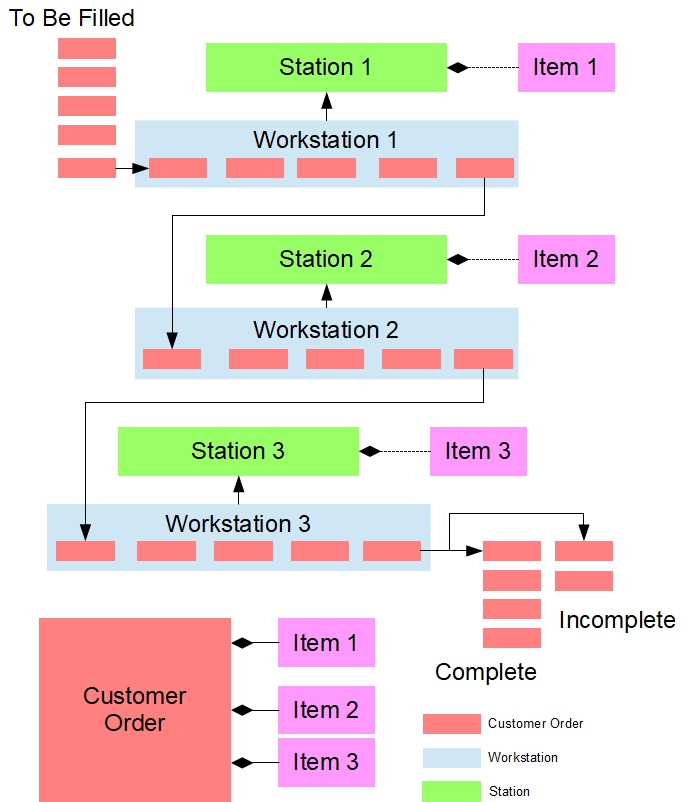

# Workshop #4: Factory Assembly Line

The purpose of this workshop is to put your C++ Object Oriented skills to practice by developing a simulation of an assembly line with any number of stations. A line with 3 Stations is illustrated in the figure below.



The assembly line in your solution consists of a set of workstations each of which holds a set of stock items, which are specific to the station. A line manager moves customer orders along the line filling the orders at each station, as requested. Each customer order consists of a list of items that need to be filled. Each station processes a queue of orders by filling the next order in the queue if that order requests the station's item and that item is in stock. The line manager keeps moving the customer orders from station to station until all orders have been processed. Any station that has used all the items in stock cannot fill any more orders. At the end of the line orders are either completed or incomplete due to a lack of inventory at one or more stations. The simulator lists the completed orders and those that are incomplete once the line manager has finished processing all orders.

The workshop is divided into 3 testers to help guide you through implementation, debugging and execution.  Each tester will focus on different aspects/classes of your solution. For full credit, you must have three submissions (one with each tester); however it is possible to get partial marks by submitting using only some testers.

This application is more complex than previous workshops and **will put your debugging skills to full use**.


| Submission using tester | Max (%) |
| ----------------------- | ------- |
| #1                      |  20%    |
| #2                      |  30%    |
| #3                      |  50%    |


## Submission Policy

The workshop should contain ***only work done by you this term*** or provided by your professor.  Work done in another term (by you or somebody else), or work done by somebody else and not **clearly identified/cited** is considered plagiarism, in violation of the Academic Integrity Policy.

Every file that you submit must contain (as a comment) at the top **your name**, **your Seneca email**, **Seneca Student ID** and the **date** when you completed the work.

- If the file contains only your work, or work provided to you by your professor, add the following message as a comment at the top of the file:

    > I declare that this submission is the result of my own work and I only copied the code that my professor provided to complete my workshops and assignments. This submitted piece of work has not been shared with any other student or 3rd party content provider.

- If the file contains work that is not yours (you found it online or somebody provided it to you), **write exactly which parts of the assignment are given to you as help, who gave it to you, or which source you received it from.**  By doing this you will only lose the mark for the parts you got help for, and the person helping you will be clear of any wrong doing.

All of your source code, including externally linked variables, should be in the `seneca` namespace. Use class declarations in header files wherever appropriate.


## Compiling and Testing Your Program

All your code should be compiled using this command on `matrix`:

```bash
/usr/local/gcc/10.2.0/bin/g++ -Wall -std=c++17 -g -o ws file1.cpp file2.cpp ...
```

- `-Wall`: compiler will report all warnings
- `-std=c++17`: the code will be compiled using the C++17 standard
- `-g`: the executable file will contain debugging symbols, allowing *valgrind* to create better reports
- `-o ws`: the compiled application will be named `ws`

After compiling and testing your code, run your program as following to check for possible memory leaks (assuming your executable name is `ws`):

```bash
valgrind --show-error-list=yes --leak-check=full --show-leak-kinds=all --track-origins=yes ws
```

- `--show-error-list=yes`: show the list of detected errors
- `--leak-check=full`: check for all types of memory problems
- `--show-leak-kinds=all`: show all types of memory leaks identified (enabled by the previous flag)
- `--track-origins=yes`: tracks the origin of uninitialized values (`g++` must use `-g` flag for compilation, so the information displayed here is meaningful).

To check the output, use a program that can compare text files.  Search online for such a program for your platform, or use `diff` available on `matrix`.


# Factory Assembly Line

## Tester Modules

To test your application, you are provided with 3 different tester modules (do not modify any of them them):
- `tester_1`: will focus on the functionality offered by the `Utilities` and `Station` modules.
- `tester_2`: will focus on the functionality offered by the `CustomerOrder` module, and make use of the functionality offered by the previous modules.
- `tester_3`: will focus on the functionality offered by the `Workstation` and `LineManager` modules, and make use of the functionality offered by the previous modules.  **Passing the tests performed by `tester_3` will require very strong debugging skills** and a deep understanding of how the assembly line works; discuss at the lab with your professor.

For each tester, the expected sample output is provided. Look in each file for the command line necessary to start the application and the expected output.


## `Utilities` Module

The `Utilities` module supports the parsing of input files, which contain information used to setup and configure the assembly line.

Parsing string data from input files into tokens is performed uniformly for all objects within the simulation system.  The `Utilities` type provides the basic functionality required for all objects in the system.

The `Utilities` class has the following structure:

### Instance Variable

-  `m_widthField` -- specifies the length of the token extracted; used for display purposes; default value is `1`.


### Class Variable

-  `m_delimiter` -- separates the tokens in any given `std::string` object. All `Utilities` objects in the system **share the same delimiter**.


### Member Functions

- `void setFieldWidth(size_t newWidth)` -- sets the field width of the current object to the value of parameter `newWidth`

- `size_t getFieldWidth() const` -- returns the field width of the current object

- `std::string extractToken(const std::string& str, size_t& next_pos, bool& more)` -- extracts a token from string `str` referred to by the first parameter.

    This function:

    -  uses the delimiter to extract the next token from `str` starting at position `next_pos`.
        -  If successful, return a copy of the extracted token found (without spaces at the beginning/end), update `next_pos` with the position of the next token, and set `more` to `true` (`false` otherwise).
    -  reports an exception if a delimiter is found at `next_pos`.
    -  updates the current object's `m_widthField` data member if its current value is less than the size of the token extracted.

    **Note:**  in this application, `str` represents a single line that has been read from an input file.


### Class Functions

-  `static void setDelimiter(char newDelimiter)` -- sets the delimiter for this class to the character received
-  `static char getDelimiter()` -- returns the delimiter for this class.


## `Station` Module

The `Station` module manages information about a station on the assembly line, which holds a specific item and fills customer orders.

The `Station` class has the following structure:

### Instance Variables

- the id of the station (integer)
- the name of the item handled by the station (string)
- the description of the station (string)
- the next serial number to be assigned to an item at this station (non-negative integer)
- the number of items currently in stock (non-negative integer)

### Class Variables

- `m_widthField` -- the maximum number of characters required to print to the screen the *item name* for any object of type `Station`.  Initial value is 0.
- `id_generator` -- a variable used to generate IDs for new instances of type `Station`. Every time a new instance is created, the current value of the `id_generator` is stored in that instance, and `id_generator` is incremented.  Initial value is 0.

### Public Functions

-  custom 1-argument constructor
    - upon instantiation, a `Station` object receives a reference to an unmodifiable `std::string`.  This string contains a single record (one line) that has been retrieved from the input file specified by the user.
    - this constructor uses a `Utilities` object (defined locally) to extract each token from the record and populates the `Station` object accordingly.
    - this constructor assumes that the string contains 4 fields separated by the delimiter, in the following order:
        - name of the item
        - starting serial number
        - quantity in stock
        - description
    - the token delimiter is a single character, specified by the client and previously stored into the `Utilities` class of objects.
    - this constructor extracts *name*, *starting serial number*, and *quantity* from the string first
    - before extracting *description*, it updates `Station::m_widthField` to the maximum value of `Station::m_widthField` and `Utilities::m_widthField`.
        - **Note:**  the `display(...)` member function uses this field width to align the output across all the records retrieved from the file.

-  `const std::string& getItemName() const` - returns the name of the current `Station` object
-  `size_t getNextSerialNumber()` – returns the next serial number to be used on the assembly line and increments `m_serialNumber`
-  `size_t getQuantity() const` – returns the remaining quantity of items in the `Station` object
-  `void updateQuantity()` – subtracts 1 from the available quantity; should not drop below 0.
-  `void display(std::ostream& os, bool full) const` -- inserts information about the current object into stream `os`.
    - if the second parameter is `false`, this function inserts only the ID, name, and serial number in the format: `ID | NAME | SERIAL | `
    - if the second parameter if `true`, this function inserts the information in the following format: `ID | NAME | SERIAL | QUANTITY | DESCRIPTION`
    - the `ID` field uses 3 characters, the `NAME` field uses `m_widthField` characters, the `QUANTITY` field uses 4 characters, the `SERIAL` field uses 6 characters; the `DESCRIPTION` has no formatting options (see the sample output for other formatting options)
    - this function terminates the printed message with an endline


## `CustomerOrder` Module

The `CustomerOrder` module contains all the functionality for processing customer orders as they move from `Station` to `Station` along the assembly line. The `Station` where a given order currently rests fills a request for one item of that station, if there is any such request. 

A `CustomerOrder` object manages a single order on the assembly line and contains the following information:

The `CustomerOrder` class has the following structure:

### Item Definition

```cpp
struct Item
{
	std::string m_itemName;
	size_t m_serialNumber{0};
	bool m_isFilled{false};

	Item(const std::string& src) : m_itemName(src) {};
};
```


### Instance Variables

- `std::string m_name` – the name of the customer (e.g., John, Sara, etc)
- `std::string m_product` – the name of the product being assembled (e.g., Desktop, Laptop, etc)
- `size_t m_cntItem` – a count of the number of items in the customer's order
- `Item** m_lstItem` – a dynamically allocated array of pointers. Each element of the array points to a dynamically allocated object of type `Item` (see below). **This is the resource** that your class must manage.

### Class Variable

- `static size_t m_widthField` – the maximum width of a field, used for display purposes

### Member Functions

- default constructor
- a custom 1-argument constructor that takes a reference to an unmodifiable string.  This constructor uses a local `Utilities` object to extract the tokens from the string and populate the current instance. 
  The fields in the string are (separated by a delimiter):
  
    - Customer Name
    - Order Name
    - the list of items making up the order (at least one item)
  
  After finishing extraction, this constructor updates `CustomerOrder::m_widthField` if the current value is smaller than the value stored in `Utilities::m_widthField`.
- a `CustomerOrder` object should not allow copy operations.  The copy constructor should throw an exception if called and the copy `operator=` should be deleted.
- a move constructor. This constructor should "promise" that it doesn't throw exceptions. Use the `noexcept` keyword in the declaration and the definition.
- a move assignment operator. This operator should "promise" that it doesn't throw exceptions. Use the `noexcept` keyword in the declaration and the definition.
- a destructor
- `bool isOrderFilled() const` – returns `true` if all the items in the order have been filled; `false` otherwise
- `bool isItemFilled(const std::string& itemName) const` – returns `true` if all items specified by `itemName` have been filled. If the item doesn't exist in the order, this query returns `true`.
- `void fillItem(Station& station, std::ostream& os)` – this modifier fills **one** item in the current order that the `Station` specified in the first parameter handles.
    
    - if the order doesn't contain the item handled, this function does nothing
    - if the order contains items handled, and the `Station`'s inventory contains at least one item, this function fills the order with one single item. It subtracts 1 from the inventory and updates `Item::m_serialNumber` and `Item::m_isFilled`. It also prints the message `    Filled NAME, PRODUCT [ITEM_NAME]`.
    - if the order contains items handled but unfilled, and the inventory is empty, this function prints the message `    Unable to fill NAME, PRODUCT [ITEM_NAME]`.
    - all messages printed are terminated by an endline
- `void display(std::ostream& os) const` – this query displays the state of the current object in the format (see the sample output for details)
    ```
    CUSTOMER_NAME - PRODUCT
    [SERIAL] ITEM_NAME - STATUS
    [SERIAL] ITEM_NAME - STATUS
    ...
    ```
    - `SERIAL` - a field of width 6
    - `ITEM_NAME` - a field of size `m_widthField`
    - `STATUS` is either `FILLED` or `TO BE FILLED`
    - you must use IO manipulators to format this output.


## `Workstation` Module

The `LineManager` module first configures the assembly line and then moves `CustomerOrders` along it (from start to finish).  The `LineManager` object configures the `Workstation` objects identified by the user, and moves orders along the line one step at a time. A `Workstation` is a `Station` that the `LineManager` has activated on the user's request. At each step, every `Workstation` fills one item in a `Customer Order`, if possible. The manager moves orders from station to station. Once an order has reached the end of the line, it is either complete or incomplete. An order is incomplete if one or more stations had an insufficient number of items in stock to cover that order's requests.

The `Workstation` module consists of three double-ended queues of `CustomerOrder` and the `Workstation` class. The queues (global variables) hold the orders at either end of the assembly line:

- `g_pending` holds the orders to be placed onto the assembly line at the first station.
- `g_completed` holds the orders that have been removed from the last station and have been completely filled.
- `g_incomplete` holds the orders that have been removed from the last station and could not be filled completely.

Each queue is accessible outside this module's translation unit.

The `Workstation` class defines the structure of an active station on the assembly line and contains all the functionality for filling customer orders with station items.  Each `Workstation` is-a-kind-of `Station`. A `Workstation` object manages order processing for a single `Item` on the assembly line. Since a `Workstation` object represents a single location on the assembly line for filling customer orders with items, the object cannot be copied or moved. Make sure that this capability is deleted in your definition of the `Workstation` class.

The `Workstation` class includes the following additional information:

### Instance Variables

- `m_orders` – is a double-ended-queue with `CustomerOrders` entering the back and exiting the front.  These are orders that have been placed on this station to receive service (or already received service).
- `m_pNextStation` – a pointer to the next `Workstation` on the assembly line.


### Member Functions

- a custom 1-argument constructor -- receives a reference to an unmodifiable reference to `std::string` and passes it to the `Station` base class.  

- `void fill(std::ostream& os)` – this modifier fills the order at the front of the queue if there are `CustomerOrders` in the queue; otherwise, does nothing.

- `bool attemptToMoveOrder()` – attempts to move the order order at the front of the queue to the next station in the assembly line:
    - if the order requires no more service at this station or cannot be filled (not enough inventory), move it to the next station; otherwise do nothing
        - if there is no next station in the assembly line, then the order is moved into `g_completed` or `g_incomplete` queue
    - if an order has been moved, return `true`; `false` otherwise. 
    
- `void setNextStation(Workstation* station)` – this modifier stores the address of the referenced `Workstation` object in the pointer to the `m_pNextStation`. Parameter defaults to `nullptr`.

- `Workstation* getNextStation() const` – this query returns the address of next `Workstation`

- `void display(std::ostream& os) const` – this query inserts the name of the `Item` for which the current object is responsible into stream `os` following the format: `ITEM_NAME --> NEXT_ITEM_NAME`
    - if the current object is the last `Workstation` in the assembly line this query inserts: `ITEM_NAME --> End of Line`.
    - in either case, the message is terminated with `\n`

- `Workstation& operator+=(CustomerOrder&& newOrder)` – moves the `CustomerOrder` referenced in parameter `newOrder` to the back of the queue.


## `LineManager` Module

The `LineManager` class manages an assembly line of active stations and contains the following information:

***Instance Variables***
- `std::vector<Workstation*> m_activeLine` – the collection of workstations for the current assembly line.
- `size_t m_cntCustomerOrder` – the total number of `CustomerOrder` objects
- `Workstation* m_firstStation` - points to the first active station on the current line

***Member Functions***
- `LineManager(const std::string& file, const std::vector<Workstation*>& stations)` - this constructor receives the name of the file that identifies the active stations on the assembly line (example:  `AssemblyLine.txt`) and the collection of workstations available for configuring the assembly line.

  The file contains the linkage between workstation pairs. The format of each record in the file is `WORKSTATION|NEXT_WORKSTATION`. The records themselves are not in any particular order.

  This function stores the workstations in the order received from the file in the `m_activeLine` instance variable. It loads the contents of the file, stores the address of the next workstation in each element of the collection, identifies the first station in the assembly line and stores its address in the `m_firstStation` attribute. This function also updates the attribute that holds the total number of orders in the `g_pending` queue.  If something goes wrong, this constructor reports an error. 

  **Note**: to receive full marks, use STL algorithms throughout this function, except for iterating through the file records (one `while` loop); marks will be deducted if you use any of `for`, `while` or `do-while` loops except for iterating through the file records. 

- `void reorderStations()` - this modifier reorders the workstations present in the instance variable `m_activeLine` (loaded by the constructor) and stores the reordered collection in the same instance variable. The elements in the reordered collection start with the first station, proceeds to the next, and so forth until the end of the line. 

- `bool run(std::ostream& os)` –  this modifier performs **one** iteration of operations on all of the workstations in the current assembly line by doing the following:
    - keeps track of the current iteration number (use a local variable)
    - inserts into stream `os` the iteration number (how many times this function has been called by the client) in the format `Line Manager Iteration: COUNT<endl>`
    - moves the order at the front of the `g_pending` queue to the `m_firstStation` and remove it from the queue. This function moves only one order to the line on a single iteration.
    - for each station on the line, executes one fill operation
    - for each station on the line, attempts to move an order down the line
    - return `true` if all customer orders have been filled or cannot be filled, otherwise returns `false`.
- `void display(std::ostream& os) const` -- this query displays all active stations on the assembly line in their current order


## Submission

Create a **text** file named `reflect.txt`.  Add any comments you wish to make.

For `tester_1`, the upload to matrix the files:
- `Utilities.h`
- `Utilities.cpp`
- `Station.h`
- `Station.cpp`
- `reflect.txt`

From a command prompt, execute the following command:

```bash
~profname.proflastname/submit 345_w4_tester_1
```


For `tester_2`, the upload to matrix the files:
- `Utilities.h`
- `Utilities.cpp`
- `Station.h`
- `Station.cpp`
- `CustomerOrder.h`
- `CustomerOrder.cpp`
- `reflect.txt`

From a command prompt, execute the following command:

```bash
~profname.proflastname/submit 345_w4_tester_2
```


For `tester_3`, the upload to matrix the files:
- `Utilities.h`
- `Utilities.cpp`
- `Station.h`
- `Station.cpp`
- `CustomerOrder.h`
- `CustomerOrder.cpp`
- `Workstation.h`
- `Workstation.cpp`
- `LineManager.h`
- `LineManager.cpp`
- `reflect.txt`

From a command prompt, execute the following command:

```bash
~profname.proflastname/submit 345_w4_tester_3
```

> [!WARNING]
> Please note that a successful submission does not guarantee full credit for this workshop. If the professor is not satisfied with your implementation, your professor may ask you to resubmit. Resubmissions will attract a penalty.
